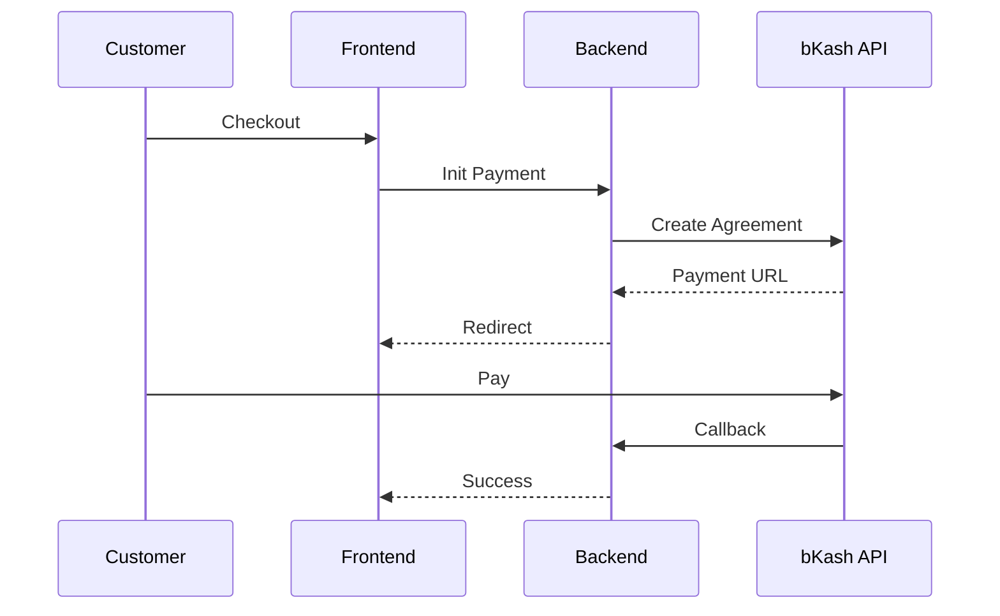

<div align="center">


# 🌸 RongRani

### *Elegance In Every Hue*

[](https://github.com/salahuddingfx)
[](https://www.mongodb.com/mern-stack)
[](https://rongrani.vercel.app)
[](LICENSE)

;Flash+Sale+Campaigns;Seamless+bKash+Integration)

---

<p align="center">
  <b>RongRani</b> is an ultra-premium e-commerce experience crafted for the curated artisan market in Bangladesh. 
  Built with the modern <b>MERN</b> stack, it blends traditional craftsmanship with high-end digital aesthetics.
</p>

</div>

---

## 📋 Table of Contents
- [✨ Features](#-features)
- [🎨 Screenshots](#-screenshots)
- [🛠️ Tech Stack](#️-tech-stack)
- [🚀 Getting Started](#-getting-started)
- [💳 bKash Integration](#-bkash-integration)
- [📁 Project Structure](#-project-structure)
- [🌐 API Documentation](#-api-documentation)
- [🎯 Roadmap](#-roadmap)
- [🤝 Contributing](#-contributing)

---

## ✨ Features

<div align="center">

| 🏷️ **Bespoke Shopping** | 👨‍💼 **Management Hub** | 💳 **Seamless UX** |
| :--- | :--- | :--- |
| • **Advanced Filtering** & Smart Search | • **Real-time Analytics** Dashboard | • **bKash Tokenized** Integration |
| • **Flash Sales** with Countdown Timers | • **Dynamic Banner** & Content Control | • **PWA Support** (Installable App) |
| • **Bespoke Invoices** (Manifest Style) | • **Automated Inventory** Tracking | • **Bilingual (BN/EN)** Persistence |
| • **Order Tracking** with Guest Reviews | • **Review Moderation** System | • **Luxury Email** Notifications |

</div>

---

## 🎨 Creative Showcase (Screenshots)

<div align="center">

### 💎 User Experience
| **🏠 Home Manifest** | **🛍️ Premium Shop** |
|:---:|:---:|
|  |  |
| *Luxury Landing & Hero* | *Dynamic Collection Grid* |

| **⚡ Blitz Deals** | **🔍 Order Registry** |
|:---:|:---:|
|  |  |
| *Flash Sale Excitement* | *Real-time Manifest Tracking* |

### 🛠️ The Command Center
| **📊 Analytics** | **📦 Inventory** |
|:---:|:---:|
|  |  |
| *Strategic Insights* | *Bespoke Catalog Control* |

### 📜 Brand Identity
| **📑 Artisan Invoice** | **📲 Mobile PWA** |
|:---:|:---:|
|  |  |
| *High-End PDF Generation* | *App-like Fluidity* |

</div>

---

## �️ The MERN Stack Architecture

<div align="center">
  
  
  
  
</div>

### 💻 Frontend (React.js)
```javascript
{
  "framework": "React 18.2.0 (Vite)",
  "styling": "TailwindCSS + Custom Nightowl Animations",
  "state_management": "Context API",
  "routing": "React Router DOM v6",
  "http_client": "Axios",
  "pwa": "Vite PWA Plugin (Offline Support)",
  "icons": "Lucide React",
  "notifications": "React Hot Toast"
}
```

### ⚙️ Backend (Node.js & Express)
```javascript
{
  "runtime": "Node.js (LTS)",
  "framework": "Express.js",
  "database": "MongoDB (Mongoose ODM)",
  "auth": "JWT (JSON Web Tokens)",
  "realtime": "Socket.io",
  "payments": "bKash Tokenized API",
  "security": "Helmet, CORS, Rate Limiting",
  "email": "Nodemailer (Premium Templates)"
}
```

---

## � Getting Started

### Prerequisites
Ensure you have the following installed:
- **Node.js**: v18.x or higher
- **MongoDB**: v6.0 or higher
- **npm**: v9.x or higher

### 📥 Installation Steps

1. **Clone the project**:
   ```bash
   git clone https://github.com/salahuddingfx/rongrani.git
   cd rongrani
   ```

2. **Setup Backend**:
   ```bash
   cd backend
   npm install
   # Create a .env file based on .env.example
   npm run dev
   ```

3. **Setup Frontend**:
   ```bash
   # Back to root
   cd ..
   npm install
   npm run dev
   ```

### 🔑 Configuration (Environment Variables)
```env
PORT=5000
MONGO_URI=your_mongodb_uri
JWT_SECRET=your_secret
BKASH_APP_KEY=your_key
BKASH_APP_SECRET=your_secret
BKASH_USERNAME=your_username
BKASH_PASSWORD=your_password
EMAIL_USER=your_gmail
EMAIL_PASS=your_app_password
```

---

## 💳 bKash Integration



---

## 📁 Project Structure
```text
rongrani/
├── 📂 backend/         # Node.js API
│   ├── 📂 controllers/ # Logic
│   ├── 📂 models/      # Database Schemas
│   ├── 📂 routes/      # API Endpoints
│   └── 📂 utils/       # PDF & Helpers
├── 📂 src/             # React Frontend
│   ├── 📂 components/  # Shared UI
│   ├── 📂 pages/       # View Logic
│   └── 📂 contexts/    # State Management
└── 📂 public/          # Static Assets
```

---

## 🌐 API Documentation

| Method | Endpoint | Description |
| :--- | :--- | :--- |
| **POST** | `/api/auth/login` | Secure JWT Login |
| **GET** | `/api/products` | Paginated Product List |
| **POST** | `/api/orders` | Create New Order |
| **GET** | `/api/flash-sales/active` | Current Live Deals |
| **POST** | `/api/payment/init` | Start bKash Process |

---

## 🎯 Roadmap
- [x] **MERN Core Flow** (DONE)
* [x] **Premium Signature Invoices** (DONE)
- [x] **Flash Sale Manager** (DONE)
- [ ] **AI-Powered Gift Finder** (WIP)
- [ ] **Multi-vendor Dashboard**

---

## 👨‍💻 Author

<div align="center">


[](https://linkedin.com/in/salahuddingfx)
[](https://salahuddin.codes)

**Visionary Architect behind RongRani**

</div>

---

<div align="center">

### ⭐ Star if you find this project helpful!


**Made with ❤️ by Salah Uddin Kader**

</div>