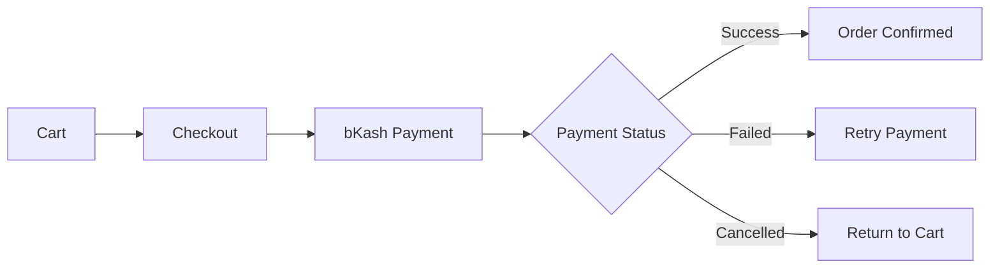
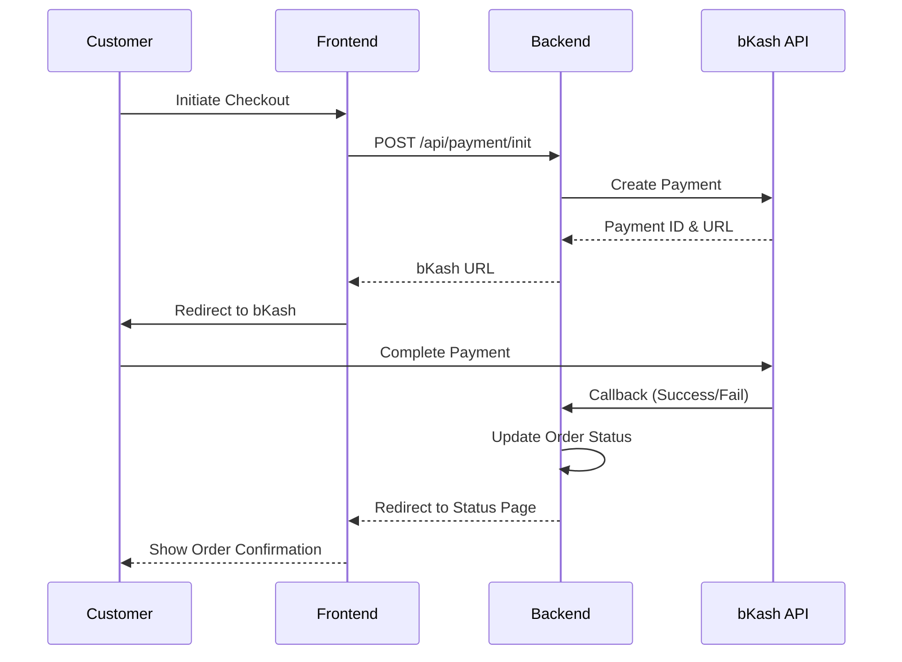

<div align="center">


### 🌟 Full-Stack Premium E-Commerce Platform with Bilingual Support

;bKash+Payment+Integration;Flash+Sale+Campaigns;Premium+Manifest+Invoices;AI-Powered+Recommendations)

[🚀 Live Demo](#) | [📖 Documentation](#-features) | [🐛 Report Bug](https://github.com/salahuddingfx/rongrani/issues) | [✨ Request Feature](https://github.com/salahuddingfx/rongrani/issues)


</div>

---

## 📋 Table of Contents

- [✨ Features](#-features)
- [🎨 Screenshots](#-screenshots)
- [🛠️ Tech Stack](#️-tech-stack)
- [🚀 Getting Started](#-getting-started)
- [💳 bKash Integration](#-bkash-integration)
- [📁 Project Structure](#-project-structure)
- [🔧 Configuration](#-configuration)
- [🌐 API Documentation](#-api-documentation)
- [🎯 Roadmap](#-roadmap)
- [🤝 Contributing](#-contributing)
- [📄 License](#-license)
- [👨‍💻 Author](#-author)

---

<div align="center">

## ✨ Features


</div>

### 🛍️ Customer Features

<table>
<tr>
<td width="50%">

#### 🎯 Core Shopping Experience
- ✅ **Product Browsing** with advanced filters
- ✅ **Smart Search** with real-time suggestions
- ✅ **Product Categories** with beautiful UI
- ✅ **Wishlist** functionality
- ✅ **Shopping Cart** with quantity management
- ✅ **Guest Checkout** support
- ✅ **Order Tracking** system with direct reviews
- ✅ **Product Reviews** & ratings (Guest & User)
- ✅ **Flash Sales** with real-time countdowns
- ✅ **Ultra-Premium Invoices** (Bespoke Curation Registry)
- ✅ **Guest Checkout** with automated verification

</td>
<td width="50%">

#### 🌟 Enhanced Features
- ✅ **Hot Offers** banner system
- ✅ **Recently Viewed** function
- ✅ **WhatsApp Integration** (Live Support)
- ✅ **PWA Support** (Installable as App)
- ✅ **AI-Powered Recommendations**
- ✅ **Real-time Notifications** (Socket.io)
- ✅ **Newsletter** subscription
- ✅ **Responsive Design** (Mobile-first)

</td>
</tr>
</table>

### 🌐 Bilingual Support

<div align="center">

| Feature | Status |
|---------|--------|
| 🇧🇩 **Full Bengali Translation** | ✅ Complete UI in Bengali |
| 🇬🇧 **English Support** | ✅ Seamless language switching |
| 💾 **Persistent Language** | ✅ Saves user preference |
| 🔄 **Dynamic Content** | ✅ All content translates instantly |

</div>

### 💳 Payment & Checkout

<div align="center">



</div>

- 💰 **bKash Integration** - Secure mobile payment
- 📦 **Multiple Delivery Options**
- 🎟️ **Coupon System** with validation
- 📧 **Premium Luxury Email System** - Animated, bespoke theme notifications
- 📜 **Bespoke Curation Registry** - High-end PDF invoices with loyalty rewards
- 🎁 **Loyalty Discount System** - Incentivize repeat purchases with codes
- 📱 **SMS Notifications** (optional)
- 🔄 **Refund System** (Admin)

### 👨‍💼 Admin Panel

<table>
<tr>
<td width="50%">

#### 📊 Dashboard & Analytics
- ✅ **Sales Analytics** with charts
- ✅ **Revenue Tracking**
- ✅ **Customer Insights**
- ✅ **Product Performance**
- ✅ **Real-time Statistics**
- ✅ **Responsive Design**

</td>
<td width="50%">

#### 🔧 Management Tools
- ✅ **Product Management** (CRUD)
- ✅ **Order Management**
- ✅ **User Management**
- ✅ **Category Management**
- ✅ **Banner Management**
- ✅ **Hot Offer Settings**
- ✅ **Review Moderation**
- ✅ **Coupon Management**

</td>
</tr>
</table>
</div>

### 📱 PWA & Mobile App
<div align="center">

| Feature | Details |
|---------|---------|
| 📲 **Installable App** | Add to Home Screen on iOS & Android |
| 📴 **Offline Support** | Browse key pages without internet |
| 🔔 **Push Experience** | App-like feel with smooth transitions |
| ⚡ **Performance** | Cached assets for instant loading |

</div>

### 🚚 Delivery Logistics & Fees
<div align="center">

| Location | Charge | Threshold for Free Shipping |
|----------|--------|-----------------------------|
| 🏙️ **Inside Cox's Bazar** | ৳70 | > ৳2500 Order |
| 🌄 **Outside Cox's Bazar** | ৳150 | > ৳2500 Order |

*Dynamic fee calculation based on shipping address selection.*

</div>

### 💬 Customer Support Channels
<div align="center">

| Channel | Availability | Features |
|---------|--------------|----------|
| 🟢 **WhatsApp** | 24/7 | Instant Chat, Quick Replies |
| 🤖 **AI Assistant** | Always On | Product Suggestions, FAQs |
| 📧 **Email Support** | 24 Hours | Order Issues, Detailed Queries |
| 📞 **Hotline** | 10 AM - 10 PM | Direct Phone Support |

</div>

### 🎨 Design & UX

<div align="center">

| Feature | Description |
|---------|-------------|
| 🎨 **Modern UI/UX** | Clean, intuitive interface |
| 📱 **Fully Responsive** | Mobile-first design approach |
| ⚡ **Fast Performance** | Optimized loading & rendering |
| 🌈 **Smooth Animations** | Delightful page transitions |
| 🎭 **Dark Mode** | Theme support with toggle |
| ♿ **Accessible** | WCAG 2.1 compliant |

</div>

---

<div align="center">

## 🎨 Screenshots


### ✨ User Experience
| **🏠 Home Page** | **🛍️ Shop Collection** |
|:---:|:---:|
|  |  |
| *Premium Landing & Hero* | *Dynamic Filters & Search* |

| **⚡ Flash Sales** | **🔍 Order Tracking** |
|:---:|:---:|
|  |  |
| *Time-Limited Excitement* | *Live Status Updates* |

### 👨‍💼 Management Hub
| **📊 Dashboard** | **📦 Products** |
|:---:|:---:|
|  |  |
| *Real-time Analytics* | *Inventory Control* |

### 📜 Brand Assets
| **📑 Premium Invoice** | **📲 Mobile PWA** |
|:---:|:---:|
|  |  |
| *Bespoke Manifest Design* | *App-like Experience* |

</div>

---

<div align="center">

## 🛠️ Tech Stack


</div>

### Frontend

```javascript
{
  "framework": "React 18.2.0",
  "routing": "React Router DOM 6.x",
  "styling": "TailwindCSS 3.3",
  "state": "Context API",
  "http": "Axios",
  "icons": "Lucide React",
  "notifications": "React Hot Toast",
  "seo": "React Helmet Async",
  "charts": "Recharts",
  "animations": "Custom CSS + Framer Motion"
}
```

### Backend

```javascript
{
  "runtime": "Node.js 18.x",
  "framework": "Express 4.18",
  "database": "MongoDB 6.0",
  "odm": "Mongoose",
  "authentication": "JWT",
  "payment": "bKash Tokenized API",
  "email": "Nodemailer",
  "realtime": "Socket.io",
  "security": "Helmet, CORS, Rate Limiting"
}
```

### DevOps & Tools

<div align="center">

| Tool | Purpose |
|------|---------|
| 🔧 **Git & GitHub** | Version Control |
| 📦 **npm** | Package Manager |
| 🔍 **ESLint** | Code Quality |
| 🎨 **PostCSS** | CSS Processing |
| 🚀 **Vite** | Build Tool |
| 📝 **dotenv** | Environment Variables |
| ⚡ **Vercel**  | Frontend Hosting  |
| 🖥️ **Render**  | Backend Hosting   |
| 📱 **PWA**     | Mobile Experience |

</div>

---

<div align="center">

## 🚀 Getting Started


</div>

### Prerequisites

Before you begin, ensure you have the following installed:

```bash
node --version  # v18.x or higher
npm --version   # v9.x or higher
mongod --version # v6.0 or higher
git --version   # v2.x or higher
```

### Installation

<details>
<summary><b>📥 Click to expand installation steps</b></summary>

#### 1️⃣ Clone the repository

```bash
git clone https://github.com/salahuddingfx/rongrani.git
cd rongrani
```

#### 2️⃣ Install Backend Dependencies

```bash
cd backend
npm install
```

#### 3️⃣ Install Frontend Dependencies

```bash
cd ..
npm install
```

#### 4️⃣ Configure Environment Variables

Create `.env` file in the `backend` folder:

```env
# Server Configuration
PORT=5000
NODE_ENV=development

# Database
MONGO_URI=mongodb://localhost:27017/rongrani

# JWT
JWT_SECRET=your_super_secret_jwt_key_here
JWT_EXPIRE=7d

# bKash Payment Gateway
BKASH_BASE_URL=https://tokenized.sandbox.bka.sh/v1.2.0-beta
BKASH_APP_KEY=your_bkash_app_key
BKASH_APP_SECRET=your_bkash_app_secret
BKASH_USERNAME=your_bkash_username
BKASH_PASSWORD=your_bkash_password

# Email Configuration
EMAIL_HOST=smtp.gmail.com
EMAIL_PORT=587
EMAIL_USER=your_email@gmail.com
EMAIL_PASS=your_app_password

# Frontend URL
CLIENT_URL=http://localhost:3000
```

#### 5️⃣ Start MongoDB

```bash
# Windows
net start MongoDB

# macOS/Linux
sudo systemctl start mongod
```

#### 6️⃣ Run the Application

**Backend:**
```bash
cd backend
npm run dev
```

**Frontend:**
```bash
npm run dev
```

#### 7️⃣ Access the Application

- 🌐 **Frontend**: http://localhost:3000
- 🔧 **Backend API**: http://localhost:5000
- 👨‍💼 **Admin Panel**: http://localhost:3000/admin

#### 8️⃣ Database Seeding (Optional)

To populate your database with premium starting data (categories & products):

```bash
cd backend
node scripts/seedCategories.js
node scripts/seedProducts.js
```

</details>

### Default Admin Credentials

```
Email: admin@rongrani.com
Password: admin123
```

> ⚠️ **Important**: Change these credentials after first login!

---

<div align="center">

## 💳 bKash Integration


</div>

### Setup Guide

1. **Register as bKash Merchant**
   - Visit: https://developer.bka.sh/
   - Create merchant account
   - Complete KYC verification

2. **Get API Credentials**
   ```
   App Key
   App Secret
   Username
   Password
   ```

3. **Configure Environment**
   ```env
   # Sandbox (Testing)
   BKASH_BASE_URL=https://tokenized.sandbox.bka.sh/v1.2.0-beta
   
   # Production (Live)
   BKASH_BASE_URL=https://tokenized.pay.bka.sh/v1.2.0-beta
   ```

4. **Test Payment Flow**
   - Use sandbox credentials
   - Test with dummy phone numbers
   - Verify callbacks

### Payment Flow



### API Endpoints

| Method | Endpoint | Description |
|--------|----------|-------------|
| POST | `/api/payment/init` | Initialize payment |
| POST | `/api/payment/execute` | Execute payment |
| GET | `/api/payment/query/:id` | Query payment status |
| POST | `/api/payment/refund` | Refund payment (Admin) |

---

## 📁 Project Structure

```
rongrani/
├── 📂 backend/                 # Backend Node.js application
│   ├── 📂 config/             # Configuration files
│   │   └── db.js              # MongoDB connection
│   ├── 📂 controllers/        # Route controllers
│   │   ├── auth.controller.js
│   │   ├── product.controller.js
│   │   ├── order.controller.js
│   │   └── payment.controller.js
│   ├── 📂 middlewares/        # Custom middlewares
│   │   ├── auth.middleware.js
│   │   └── error.middleware.js
│   ├── 📂 models/             # Mongoose models
│   │   ├── User.js
│   │   ├── Product.js
│   │   ├── Order.js
│   │   └── Review.js
│   ├── 📂 routes/             # API routes
│   │   ├── auth.routes.js
│   │   ├── product.routes.js
│   │   ├── order.routes.js
│   │   └── payment.routes.js
│   ├── 📂 utils/              # Utility functions
│   ├── 📂 uploads/            # File uploads
│   ├── 📄 server.js           # Entry point
│   ├── 📄 .env.example        # Environment template
│   └── 📄 package.json
│
├── 📂 src/                     # Frontend React application
│   ├── 📂 components/         # Reusable components
│   │   ├── Navbar.jsx
│   │   ├── Footer.jsx
│   │   ├── ProductCard.jsx
│   │   └── AdminLayout.jsx
│   ├── 📂 contexts/           # React contexts
│   │   ├── AuthContext.jsx
│   │   ├── CartContext.jsx
│   │   ├── LanguageContext.jsx
│   │   └── ThemeContext.jsx
│   ├── 📂 pages/              # Page components
│   │   ├── Home.jsx
│   │   ├── Shop.jsx
│   │   ├── ProductDetail.jsx
│   │   ├── Cart.jsx
│   │   ├── Checkout.jsx
│   │   └── Reviews.jsx
│   ├── 📂 utils/              # Utility functions
│   ├── 📂 assets/             # Static assets
│   ├── 📄 App.jsx             # Main App component
│   ├── 📄 main.jsx            # Entry point
│   └── 📄 index.css           # Global styles
│
├── 📂 public/                  # Public assets
├── 📄 package.json
├── 📄 tailwind.config.js
├── 📄 vite.config.js
└── 📄 README.md
```

---

## 🔧 Configuration

### TailwindCSS Custom Colors

```javascript
// tailwind.config.js
module.exports = {
  theme: {
    extend: {
      colors: {
        maroon: '#800020',
        cream: '#FFF8DC',
        charcoal: '#36454F',
        emerald: '#50C878',
      },
      animation: {
        'reveal-left': 'revealLeft 0.8s ease-out',
        'reveal-right': 'revealRight 0.8s ease-out',
      }
    }
  }
}
```

---

<div align="center">

## 🌐 API Documentation


</div>

### Authentication

```http
POST   /api/auth/register       # Register new user
POST   /api/auth/login          # Login user
POST   /api/auth/logout         # Logout user
GET    /api/auth/me             # Get current user
POST   /api/auth/forgot-password # Send reset email
PUT    /api/auth/reset-password/:token # Reset password
```

### Products

```http
GET    /api/products            # Get all products
GET    /api/products/:id        # Get single product
POST   /api/products            # Create product (Admin)
PUT    /api/products/:id        # Update product (Admin)
DELETE /api/products/:id        # Delete product (Admin)
GET    /api/products/category/:category # Get by category
```

### Orders

```http
GET    /api/orders              # Get user orders
GET    /api/orders/:id          # Get single order
POST   /api/orders              # Create order
PUT    /api/orders/:id          # Update order (Admin)
GET    /api/orders/track/:orderNumber # Track order
```

### Reviews

```http
GET    /api/reviews/all         # Get all reviews
GET    /api/reviews/product/:id # Get product reviews
POST   /api/reviews             # Create review
PUT    /api/reviews/:id         # Update review
DELETE /api/reviews/:id         # Delete review
```

---

<div align="center">

## 🎯 Roadmap


</div>

### Phase 1 - Core Features ✅
- [x] User Authentication
- [x] Product Management
- [x] Shopping Cart
- [x] Checkout & Payment
- [x] Order Management

### Phase 2 - Enhanced Features ✅
- [x] Bengali Translation
- [x] Reviews System
- [x] Wishlist
- [x] Admin Dashboard
- [x] Real-time Notifications
- [x] bKash Integration

### Phase 3 - Advanced Features 🚧
- [x] AI Product Recommendations (Curated)
- [ ] Advanced Analytics
- [x] Mobile App (PWA Supported)
- [ ] Multi-vendor Support
- [ ] Live Chat Support
- [ ] Voice Search

### Phase 4 - Optimization 📋
- [ ] Performance Optimization
- [ ] SEO Improvements
- [x] PWA Support (Installable App)
- [ ] Automated Testing
- [ ] CI/CD Pipeline
- [ ] Docker Containerization

---

<div align="center">

## 🤝 Contributing


</div>

Contributions are what make the open-source community such an amazing place to learn, inspire, and create. Any contributions you make are **greatly appreciated**.

### How to Contribute

1. **Fork** the Project
2. Create your Feature Branch
   ```bash
   git checkout -b feature/AmazingFeature
   ```
3. Commit your Changes
   ```bash
   git commit -m 'Add some AmazingFeature'
   ```
4. Push to the Branch
   ```bash
   git push origin feature/AmazingFeature
   ```
5. Open a **Pull Request**

### Development Guidelines

- ✅ Follow the existing code style
- ✅ Write meaningful commit messages
- ✅ Add comments for complex logic
- ✅ Test your changes thoroughly
- ✅ Update documentation as needed
- ✅ Keep PRs focused and small

---

<div align="center">

## 📄 License

Distributed under the MIT License. See `LICENSE` for more information.

---

## 👨‍💻 Author


### **Salah Uddin Kader**

[](https://github.com/salahuddingfx)
[](https://linkedin.com/in/salahuddingfx)
[](https://salahuddin.codes)
[](mailto:info.rongrani@gmail.com)

**Full Stack Developer | MERN Stack Specialist | UI/UX Designer | Graphic Designer**

#### 🚀 Notable Projects
- **StudyFlow:** [studyflow.salahuddin.codes](https://studyflow.salahuddin.codes) - A comprehensive student management platform.
- **RongRani:** A premium handmade gift shop application.

**Crafting seamless digital experiences with passion and precision.**

---

## 🙏 Acknowledgments

- [React](https://reactjs.org/) - UI Library
- [Node.js](https://nodejs.org/) - Runtime Environment
- [MongoDB](https://www.mongodb.com/) - Database
- [TailwindCSS](https://tailwindcss.com/) - CSS Framework
- [Lucide Icons](https://lucide.dev/) - Icon Library
- [bKash](https://www.bka.sh/) - Payment Gateway
- [Socket.io](https://socket.io/) - Real-time Communication

---

<div align="center">

### ⭐ Star this repo if you find it helpful!


**Made with ❤️ by Salah Uddin Kader**


</div>