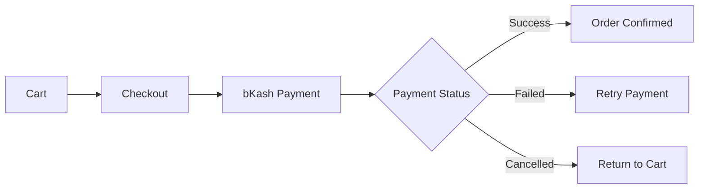
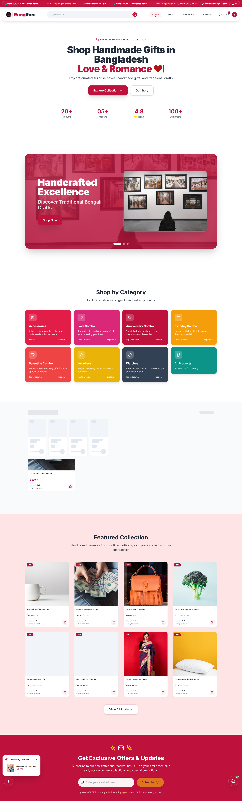
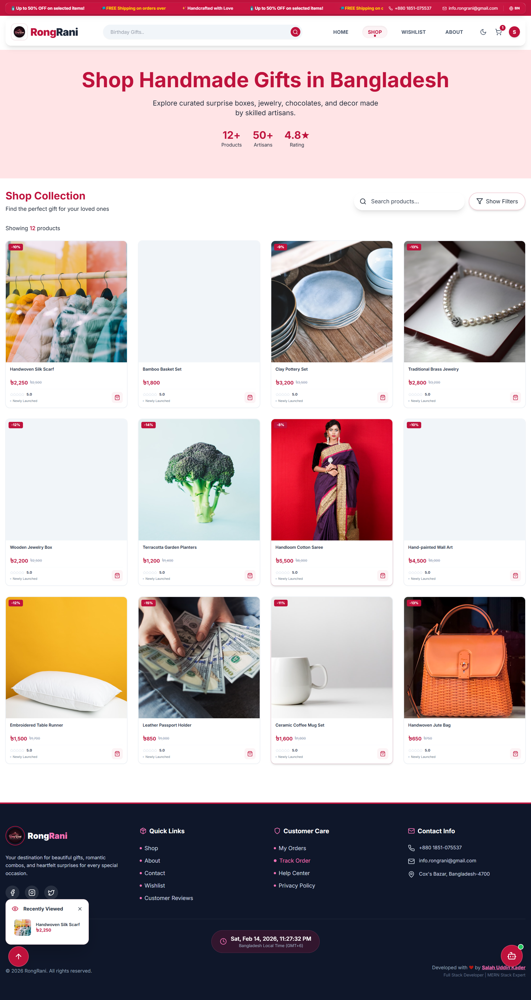
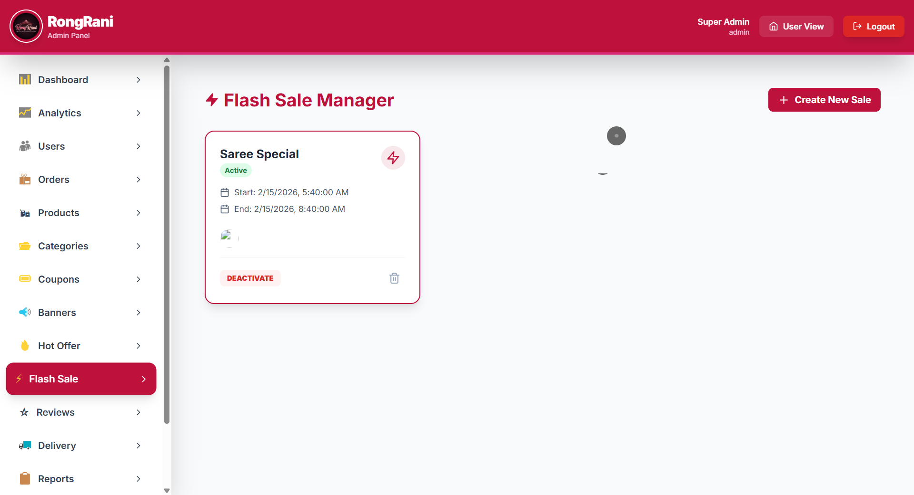
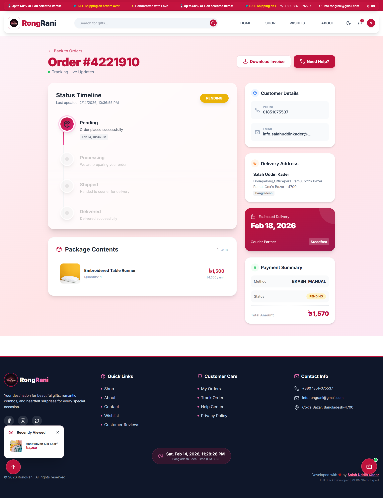
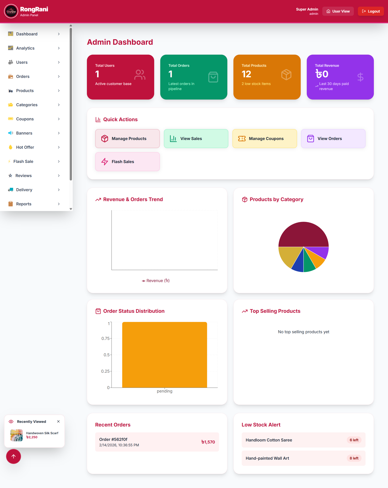
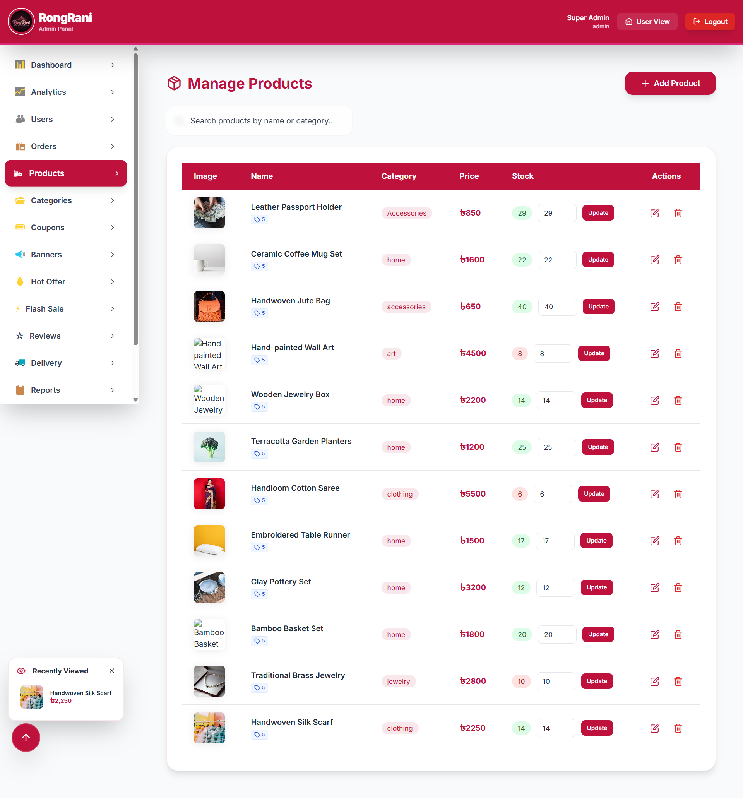
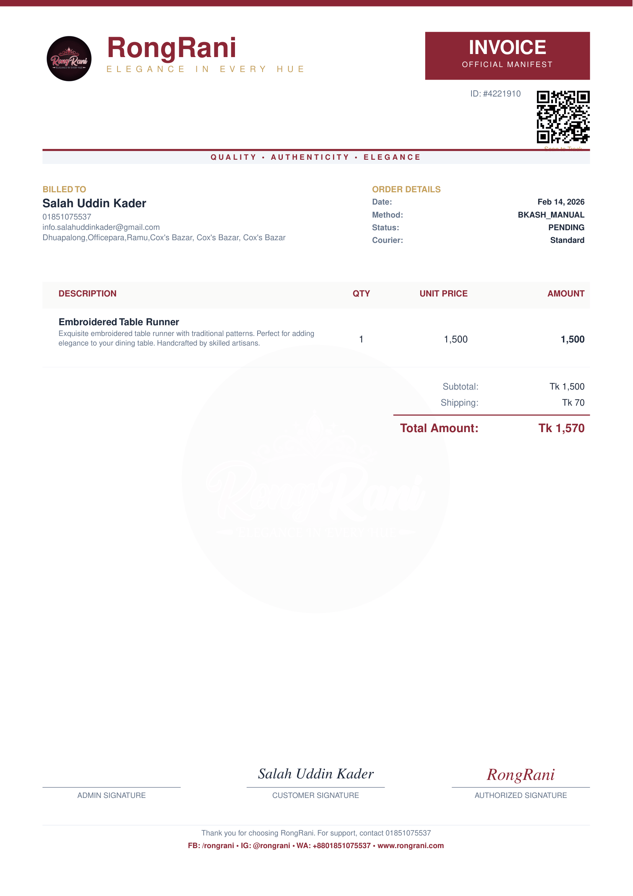
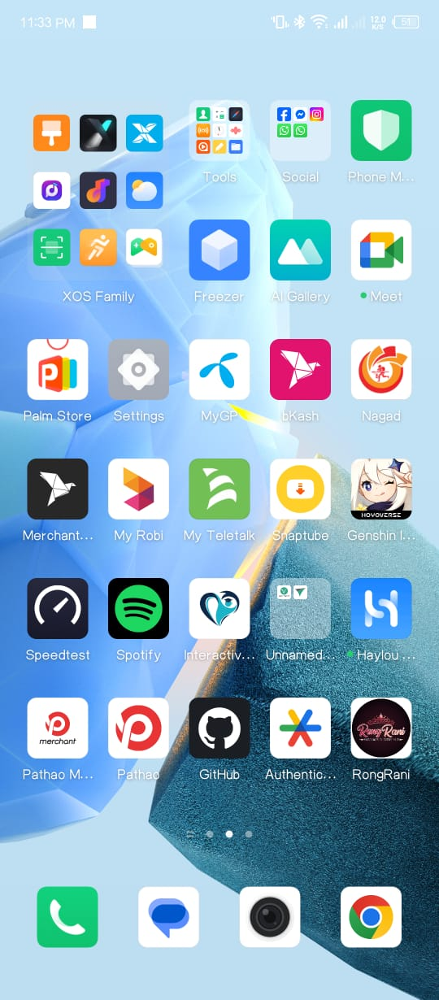
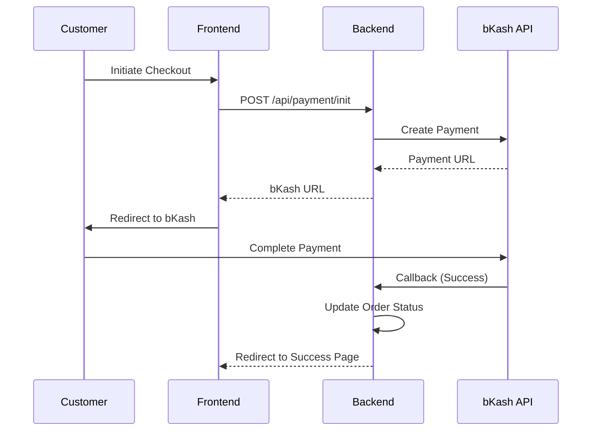

<div align="center">


# 🌸 RongRani


<p align="center">
  
  
  
  
  
</p>

### 🌟 Full-Stack Premium E-Commerce Platform with Bilingual Support

;bKash+Payment+Integration;Flash+Sale+Campaigns;Premium+Manifest+Invoices;AI+Powered+Manifests)

[🚀 Live Demo](https://rongrani.vercel.app) | [📖 Documentation](#-features) | [🐛 Report Bug](https://github.com/salahuddingfx/rongrani/issues) | [✨ Request Feature](https://github.com/salahuddingfx/rongrani/issues)


</div>

---

## 📋 Table of Contents
- [✨ Features](#-features)
- [🎨 Screenshots](#-screenshots)
- [🛠️ Tech Stack](#️-tech-stack)
- [🚀 Getting Started](#-getting-started)
- [💳 bKash Integration](#-bkash-integration)
- [📁 Project Structure](#-project-structure)
- [🌐 API Documentation](#-api-documentation)
- [🎯 Roadmap](#-roadmap)
- [🤝 Contributing](#-contributing)
- [📄 License](#-license)
- [👨‍💻 Author](#-author)

---

<div align="center">

## ✨ Features


</div>

### �️ Customer Features

<table width="100%">
<tr>
<td width="50%">

#### 🎯 Core Shopping Experience
- ✅ **Product Browsing** with advanced filters
- ✅ **Smart Search** with real-time suggestions
- ✅ **Product Categories** with beautiful UI
- ✅ **Wishlist** functionality
- ✅ **Shopping Cart** with quantity management
- ✅ **Guest Checkout** with automated verification
- ✅ **Order Tracking** system with direct reviews
- ✅ **Flash Sales** with real-time countdowns
- ✅ **Premium Invoices** (Bespoke Curation Registry)

</td>
<td width="50%">

#### 🌟 Enhanced Features
- ✅ **Hot Offers** banner system
- ✅ **Recently Viewed** function
- ✅ **WhatsApp Integration** (Live Support)
- ✅ **PWA Support** (Installable as App)
- ✅ **AI-Powered Recommendations**
- ✅ **Real-time Notifications** (Socket.io)
- ✅ **Newsletter** subscription
- ✅ **Responsive Design** (Mobile-first)
- ✅ **Luxury Email Notifications**

</td>
</tr>
</table>

### 🌐 Bilingual Support

<div align="center">

| Feature | Status |
|:---:|:---:|
| 🇧🇩 **Full Bengali Translation** | ✅ UI/Content Complete |
| 🇬🇧 **English Support** | ✅ Seamless Switching |
| 💾 **Persistent Language** | ✅ Preference Saved |
| 🔄 **Dynamic Content** | ✅ Instant Translation |

</div>

### 💳 Payment & Checkout

<div align="center">



</div>

- 💰 **bKash Integration** - Secure mobile payment
- 📦 **Multiple Delivery Options** - Dynamic fee calculation
- 🎟️ **Coupon System** - Sophisticated validation
- 📧 **Luxury Email System** - Animated, bespoke theme notifications
- 📜 **Bespoke Curation Registry** - High-end PDF invoices with stylized signatures
- 🎁 **Loyalty Discount System** - Incentivize repeat purchases

### 🚚 Delivery Logistics & Fees

<div align="center">

| Location | Charge | Free Shipping Threshold |
|:---:|:---:|:---:|
| 🏙️ **Inside Cox's Bazar** | ৳70 | > ৳2500 Order |
| 🌄 **Outside Cox's Bazar** | ৳150 | > ৳2500 Order |

</div>

---

<div align="center">

## 🎨 Creative Showcase (Screenshots)


### ✨ User Experience
| **🏠 Home Manifest** | **🛍️ Premium Shop** |
|:---:|:---:|
|  |  |
| *Luxury Landing & Hero* | *Dynamic Collection Grid* |

| **⚡ Blitz Deals** | **🔍 Order Registry** |
|:---:|:---:|
|  |  |
| *Flash Sale Excitement* | *Real-time Manifest Tracking* |

### 🛠️ The Command Center
| **📊 Analytics** | **📦 Inventory** |
|:---:|:---:|
|  |  |
| *Strategic Insights* | *Bespoke Catalog Control* |

### 📜 Brand Identity
| **📑 Artisan Invoice** | **📲 Mobile PWA** |
|:---:|:---:|
|  |  |
| *High-End PDF Generation* | *App-like Fluidity* |

</div>

---

## 🛠️ The MERN Stack Architecture

<div align="center">
  
  
  
  
</div>

<div align="center">


</div>

### 💻 Frontend (React.js)
```javascript
{
  "framework": "React 18.2.0 (Vite)",
  "styling": "TailwindCSS + Custom Nightowl Animations",
  "state_management": "Context API",
  "routing": "React Router DOM v6",
  "http_client": "Axios",
  "pwa": "Vite PWA Plugin (Offline Support)",
  "seo": "React Helmet Async",
  "charts": "Recharts",
  "icons": "Lucide React"
}
```

### ⚙️ Backend (Node.js & Express)
```javascript
{
  "runtime": "Node.js (LTS)",
  "framework": "Express.js",
  "database": "MongoDB (Mongoose ODM)",
  "auth": "JWT (JSON Web Tokens)",
  "realtime": "Socket.io",
  "payments": "bKash Tokenized API",
  "security": "Helmet, CORS, Rate Limiting",
  "email": "Nodemailer (Premium Templates)"
}
```

---

## 🚀 Getting Started

<div align="center">

</div>

### Prerequisites
Before you begin, ensure you have the following installed:
- **Node.js**: v18.x or higher
- **MongoDB**: v6.0 or higher
- **npm**: v9.x or higher
- **Git**: v2.x or higher

### 📥 Installation Steps

<details>
<summary><b>🛠️ Full Comprehensive Install Guide (CLICK TO EXPAND)</b></summary>

#### 1️⃣ Clone the repository
```bash
git clone https://github.com/salahuddingfx/rongrani.git
cd rongrani
```

#### 2️⃣ Install Backend Dependencies
```bash
cd backend
npm install
```

#### 3️⃣ Install Frontend Dependencies
```bash
cd ..
npm install
```

#### 4️⃣ Configure Environment
Create `.env` file in the `backend` folder:
```env
PORT=5000
NODE_ENV=development
MONGO_URI=mongodb://localhost:27017/rongrani
JWT_SECRET=your_jwt_secret
BKASH_APP_KEY=your_key
BKASH_APP_SECRET=your_secret
BKASH_USERNAME=your_username
BKASH_PASSWORD=your_password
EMAIL_USER=your_email
EMAIL_PASS=your_app_pass
```

#### 5️⃣ Populate Starting Data
```bash
cd backend
node scripts/seedCategories.js
node scripts/seedProducts.js
```

#### 6️⃣ Run the App
```bash
# Terminal 1 (Backend)
cd backend && npm run dev

# Terminal 2 (Frontend)
cd .. && npm run dev
```
</details>

---

## 💳 bKash Integration

<div align="center">

</div>



---

## 📁 Project Structure
```text
rongrani/
├── 📂 backend/                 # Backend Node.js application
│   ├── 📂 config/             # DB & Env Config
│   ├── 📂 controllers/        # Business Logic
│   ├── 📂 middlewares/        # Auth & Security
│   ├── 📂 models/             # Mongoose Schemas
│   ├── 📂 routes/             # API Endpoints
│   ├── 📂 utils/              # PDF Generator & Email
│   └── 📄 server.js           # Entry Point
├── 📂 src/                     # Frontend React application
│   ├── 📂 components/         # Atomic UI Components
│   ├── 📂 contexts/           # Global State (Auth, Cart)
│   ├── 📂 locales/            # Language Translations
│   ├── 📂 pages/              # Routed Page Views
│   └── 📄 App.jsx             # Root Component
└── 📂 public/                  # Manifest, Icons & Static
```

---

## 🌐 API Documentation

<div align="center">

</div>

| Category | Method | Endpoint | Description |
| :--- | :--- | :--- | :--- |
| **Auth** | POST | `/api/auth/register` | User Onboarding |
| **Auth** | POST | `/api/auth/login` | JWT Authentication |
| **Products** | GET | `/api/products` | Paginated Collection |
| **Orders** | POST | `/api/orders` | Checkout Process |
| **Orders** | GET | `/api/orders/track/:id` | Live Tracking |
| **Reviews** | POST | `/api/reviews` | Guest & User Feedback |
| **Payment** | POST | `/api/payment/init` | bKash Tunneling |
| **Flash Sale** | GET | `/api/flash-sales/active` | Live Blitz Deals |

---

## 🎯 Roadmap

<div align="center">

</div>

- [x] **Phase 1: Foundation** - Auth, Product CRUD, Cart (DONE)
- [x] **Phase 2: Premium Expansion** - bKash, Invoices, Bengali (DONE)
- [x] **Phase 3: Engagement** - Flash Sales, Tracking, Real-time (DONE)
- [ ] **Phase 4: AI Core** - Personalized Gifting Assistant (WIP)
- [ ] **Phase 5: Logistics** - Automated RedX/Pathao Integration (PLANNED)

---

## 🛡️ License
Distributed under the **MIT License**. See `LICENSE` for more information.

---

## 👨‍💻 Author & Visionary

<div align="center">


[](https://linkedin.com/in/salahuddingfx)
[](https://salahuddin.codes)
[](mailto:info.rongrani@gmail.com)

**Full Stack Architect | UI/UX Designer | MERN Specialist**
*Crafting seamless digital experiences with passion and precision.*

</div>

---

<div align="center">

### ⭐ Star this repository if you love the manifest!


**RongRani™ 2026 - Elevated E-Commerce for Artisan Gifting**

</div>